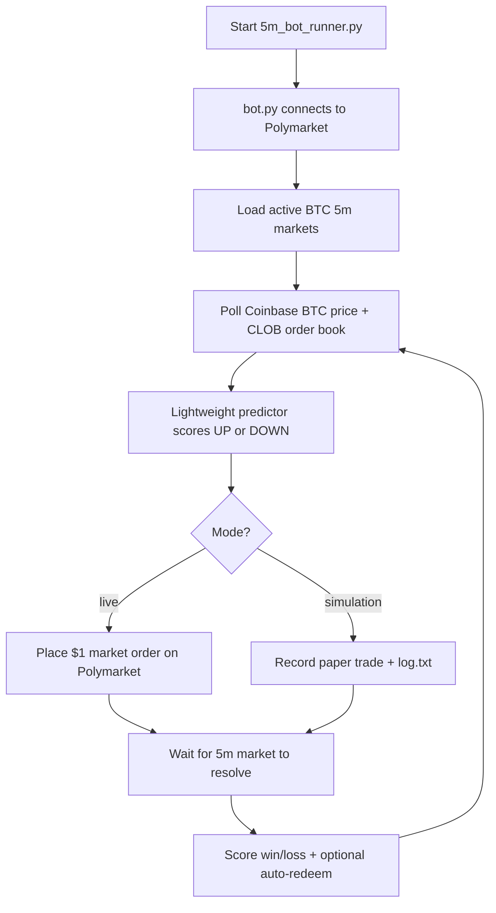

# Polymarket BTC 5-Minute Trading Bot

> **BTC 5-minute trading bot** for [Polymarket](https://polymarket.com) — automated UP/DOWN bets on Bitcoin 5m markets (`btc-updown-5m-*`). Paper trade first, go live when ready.

## Easy Mode — no coding required

**Easy Mode** is the simplest way to run this bot. You do not need to use the terminal or edit config files by hand. Everything is done from a **web dashboard** in your browser.

| Plan | Includes |
|------|----------|
| **Free** | Dashboard, practice/live trading, API setup, standard predictor (defaults), log viewer |
| **Premium** | Better predictor logic, martingale recovery, performance analytics, advanced tuning, log downloads, priority support |

**Upgrade to Premium** — contact [@dearolaf](https://t.me/dearolaf) · WhatsApp [+1 319 210 1283](https://wa.me/13192101283) · [xapple126@gmail.com](mailto:xapple126@gmail.com)

| Step | What to do |
|------|------------|
| **1. Install (once)** | Windows: double-click **`Install.bat`** · Mac/Ubuntu: `./install.sh` |
| **2. Open dashboard** | Windows: double-click **`Start.bat`** · Mac/Ubuntu: `./start.sh` |
| **3. Run the bot** | In the browser: **Setup** → paste Polymarket credentials → **Control** → **Start practice** (test) or **Start live** (real money) |

- **Practice** = simulation only, no real money  
- **Live** = real orders on Polymarket (USDC required)  
- Generate API keys with **[Generate Keys](https://polymarkettool-272623624738.us-central1.run.app/)** — one click  

### Dashboard pages

| Page | Free | Premium |
|------|------|---------|
| **Dashboard** | ✓ | ✓ |
| **Control** | ✓ | ✓ |
| **Setup** (keys & basic) | ✓ | ✓ |
| **Predictor logic** | Standard defaults | Enhanced ensemble + tuning |
| **Logs** (view) | ✓ | ✓ |
| **Performance** (charts & stats) | — | ✓ |
| **Setup → Advanced** | — | ✓ |
| **Logs** (download) | — | ✓ |
| **Plans** (why Premium is better) | ✓ | ✓ |

Full guide: [Easy Mode (no coding)](#easy-mode-no-coding) · [Plans (Free & Premium)](#plans-free--premium) · Developers: [Quick Start (terminal)](#quick-start)

<!--
GitHub About (paste into repo settings):

Description:
BTC 5-minute trading bot for Polymarket — predicts Bitcoin UP/DOWN on 5m markets, paper + live mode, Coinbase signals, auto-restart.

Website:
https://github.com/dearolaf/Polymarket-BTC-5Minutes-Trading-Bot

Topics:
polymarket, bitcoin, btc, trading-bot, crypto-bot, algorithmic-trading, 5-minute-trading, prediction-markets, nautilus-trader, python, scalping, defi
-->

[](https://www.python.org/downloads/)
[](https://nautilustrader.io/)
[](https://opensource.org/licenses/MIT)
[](https://polymarket.com)
[](https://polymarket.com)
[](https://github.com/dearolaf/Polymarket-BTC-5Minutes-Trading-Bot)

An **algorithmic trading bot** for **Polymarket's 5-minute BTC (Bitcoin) up/down markets** (`btc-updown-5m-{timestamp}`). It predicts whether BTC will go **up or down** over the next 5-minute window and places small market orders on Polymarket.

**Looking for:** Polymarket bot · BTC 5 min bot · Bitcoin 5-minute trading bot · crypto prediction market bot · automated BTC scalping · `btc-updown-5m` trader

---

## Table of Contents

- [Who This Is For](#who-this-is-for)
- [Plans (Free & Premium)](#plans-free--premium)
- [Easy Mode (no coding)](#easy-mode-no-coding)
- [How It Works](#how-it-works)
- [Features](#features)
- [Prerequisites](#prerequisites)
- [Quick Start](#quick-start)
- [Running the Bot](#running-the-bot)
- [Configuration](#configuration)
- [Logs and Output](#logs-and-output)
- [Monitoring](#monitoring)
- [Project Structure](#project-structure)
- [Testing](#testing)
- [FAQ](#faq)
- [Disclaimer](#disclaimer)
- [Community](#community)
- [Donate](#donate)

---

## Who This Is For

| You want… | This repo… |
|-----------|------------|
| A **BTC 5-minute trading bot** on Polymarket | Trades `btc-updown-5m-*` slugs every 5 minutes |
| **No coding / easy setup** | Use **Easy Mode** — `Install.bat` + `Start.bat` + web dashboard |
| **Paper trading** before risking money | Simulation mode by default (no `--live`) |
| **Small stakes** ($10/trade default) | Configurable via `MARKET_BUY_USD` |
| **API keys** for Polymarket CLOB | Use [Generate Keys](https://polymarkettool-272623624738.us-central1.run.app/) (free tool) |
| **24/7 uptime** | `5m_bot_runner.py` auto-restarts on crash |

**Not included:** Binance/Bybit spot bots, generic crypto scalpers, or 15m/SOL Polymarket markets (BTC 5m only).

---

## Plans (Free & Premium)

This project offers two tiers. **Free** lets you run the bot with standard settings. **Premium** is for traders who want **better predictor logic**, full analytics, advanced tuning, and direct support.

### Why Premium is better than Free

| Area | Free | Premium |
|------|------|---------|
| **Predictor logic** | Standard on/off with fixed default score (0.50) | **Enhanced ensemble** — Coinbase BTC price + 5-minute candles + Polymarket CLOB order-book signals with tunable min score & faster polling |
| **Signal quality** | Trades on default-qualified signals only | **Skip weak setups** — adjust predictor sensitivity, poll interval, and timing to focus on higher-confidence entries |
| **Loss recovery** | Fixed stake every trade | **Martingale recovery** — configurable base & max stake (e.g. $1 → $2 → $4, capped at your limit) |
| **Order timing** | Default submit & evaluation windows | **Precision timing** — custom seconds-before-boundary and post-round evaluation delay |
| **Auto-redeem** | Default behavior | **Full control** — tune auto-redeem and logging for faster winning-position claims |
| **Analytics** | Basic dashboard counts | **Full Performance page** — win rate, streaks, cumulative charts, UP/DOWN breakdown, result history |
| **Configuration** | Keys + basic stake settings | **Advanced dashboard tab** — martingale, timing, predictor score, poll speed, auto-redeem (no manual `.env` editing) |
| **Logs** | View in browser only | **Download** `log.txt` and `orders.log` for audit, review, and support |
| **Support** | GitHub Issues / community | **Priority 1-on-1** — Telegram, WhatsApp, email |
| **Updates** | Public stable release | **Early access** to predictor tuning & Premium strategy presets |

### Free plan

| Feature | Included |
|---------|----------|
| Web dashboard (Easy Mode) | ✓ |
| Practice & live trading (BTC 5m) | ✓ |
| API key setup | ✓ |
| Basic trade settings (stake, predictor on/off) | ✓ |
| Standard predictor with default thresholds | ✓ |
| Dashboard overview & recent signals | ✓ |
| Activity log viewer (read-only) | ✓ |
| Auto-restart bot runner | ✓ |
| Community support (GitHub Issues) | ✓ |

**Free limitations:** fixed predictor score, no martingale, no custom timing, no Performance charts, no advanced settings tab, no log downloads, no priority support.

### Premium plan

| Feature | Included |
|---------|----------|
| Everything in Free | ✓ |
| Enhanced predictor logic & tuned signal filters | ✓ |
| Multi-source ensemble (Coinbase + 5m candles + CLOB book) | ✓ |
| Custom predictor min score & poll interval | ✓ |
| Martingale recovery (configurable base & max stake) | ✓ |
| Precision order timing (submit window & eval delay) | ✓ |
| Auto-redeem optimization | ✓ |
| Performance analytics & cumulative win charts | ✓ |
| Win-rate, streak & UP/DOWN direction breakdown | ✓ |
| Advanced strategy settings in dashboard | ✓ |
| Downloadable trade & order logs | ✓ |
| Priority 1-on-1 support | ✓ |
| Optimized Premium presets & early predictor updates | ✓ |

### Upgrade to Premium

Contact us to unlock Premium on your setup:

| Channel | Contact |
|---------|---------|
| **Telegram** | [@dearolaf](https://t.me/dearolaf) |
| **WhatsApp** | [+1 319 210 1283](https://wa.me/13192101283) |
| **Email** | [xapple126@gmail.com](mailto:xapple126@gmail.com) |

After purchase, Premium is activated by adding this to your `.env`:

```env
BOT_PLAN=premium
```

---

## Easy Mode (no coding)

Use the **web dashboard** — no terminal commands needed. The sidebar shows your current plan (**Free** or **Premium**).

### Step 1 — Install (once)

| OS | Action |
|----|--------|
| **Windows** | Double-click **`Install.bat`** |
| **macOS / Ubuntu** | `chmod +x install.sh start.sh` then `./install.sh` |

### Step 2 — Open dashboard

| OS | Action |
|----|--------|
| **Windows** | Double-click **`Start.bat`** |
| **macOS / Ubuntu** | `./start.sh` |

Your browser opens the dashboard control panel.

### Step 3 — Run the bot

1. Sidebar → **Setup** → **API keys** tab → **[Generate Keys](https://polymarkettool-272623624738.us-central1.run.app/)** → paste keys → **Save keys**
2. Sidebar → **Control** → **Start practice** (simulation, no real money)
3. Sidebar → **Plans** → compare Free vs Premium or upgrade
4. Sidebar → **Performance** (Premium) → watch win rate and charts as trades complete
5. When ready → **Start live** (real money)

| Dashboard page | What it does |
|----------------|--------------|
| **Dashboard** | Live metrics, streak, recent signals |
| **Performance** | Win-rate charts and UP/DOWN stats *(Premium)* |
| **Control** | Start practice / live, stop bot |
| **Setup** | Keys, trade size, advanced strategy settings *(Advanced = Premium)* |
| **Logs** | Trade summary; downloads *(Premium)* |
| **Plans** | Free vs Premium comparison and upgrade contacts |

---

## How It Works

This is the full lifecycle in plain terms:



### Step by step

1. **You start the wrapper** — `5m_bot_runner.py` runs `bot.py` and auto-restarts it if it crashes or exits normally.
2. **The bot connects to Polymarket** — via [NautilusTrader](https://nautilustrader.io/) using your API credentials.
3. **It finds the right markets** — Polymarket runs a new BTC up/down market every 5 minutes. Slugs look like `btc-updown-5m-1747143300` (the number is the UTC interval start time).
4. **It gathers signals** — when `USE_LIGHTWEIGHT_PREDICTOR=1` (recommended):
   - Coinbase `BTC-USD` tick momentum and buy/sell flow
   - Coinbase 5-minute candle context (open vs close of the window)
   - Polymarket CLOB order-book imbalance
5. **It picks UP or DOWN** — the predictor always chooses a direction (no "skip" signal).
6. **It places an order** — in live mode, a market buy for the UP (YES) or DOWN (NO) token. Default stake is **$10** per trade (`MARKET_BUY_USD=10.0`).
7. **It waits for resolution** — after the 5-minute window ends, the bot checks whether the bet won or lost (via Polymarket's official result by default).
8. **It logs everything** — trade submissions and results go to `log.txt` and `logs/orders.log`.
9. **Repeat** — the bot targets the next eligible 5-minute market. By default it submits in the **last 60 seconds before the next slug opens**.

### Order timing (default)

| Setting | Default | Meaning |
|---------|---------|---------|
| `SUBMIT_SECONDS_BEFORE_BOUNDARY` | `60` | Submit during the last 60s before the *next* 5m market opens |
| `PREDICTOR_EVAL_POST_END_SEC` | `90` | Wait this many seconds after a market ends before scoring |
| `PREDICTOR_FULL_SLUGS_TO_SKIP_AFTER_SCORE` | `1` | Skip N full 5m bars after each scored bet before re-arming |

### Martingale (optional)

When enabled via env vars, a loss doubles the next stake ($1 → $2 → $4 → …) up to `MARTINGALE_MAX_STAKE_USD` (default $16). A win resets back to `MARTINGALE_BASE_USD` (default $1).

---

## Features

| Feature | Description |
|---------|-------------|
| **Premium dashboard** | Streamlit UI with Free & Premium plans, win-rate analytics, and advanced settings |
| **5-minute BTC markets** | Trades `btc-updown-5m-*` Polymarket slugs |
| **Lightweight predictor** | Coinbase price + 5m candles + CLOB book ensemble |
| **Small stakes** | $10 default per trade; configurable via `.env` |
| **Simulation first** | Paper trading by default — no real orders unless `--live` |
| **Auto-restart wrapper** | `5m_bot_runner.py` keeps the bot running 24/7 |
| **Auto-redeem** | Optionally redeems winning positions automatically |
| **Grafana metrics** | Optional Prometheus/Grafana dashboard |
| **Verbose logging** | `--verbose` or `BOT_VERBOSE=1` for full debug output |

---

## Prerequisites

- **Python 3.14+**
- **Git** — required because `requirements.txt` installs `py-clob-client-v2` from GitHub
- **Polymarket account** with API credentials (private key + API key/secret/passphrase)
- **USDC on Polygon** — for live trading
- **Redis** (optional) — only needed if you want to switch sim/live mode at runtime without restarting

---

## Quick Start

> **Not a programmer?** Use [Easy Mode](#easy-mode-no-coding) above (`Install.bat` → `Start.bat`).

### Developer setup (terminal)

#### 1. Clone the repository

```bash
git clone https://github.com/dearolaf/Polymarket-BTC-5Minutes-Trading-Bot.git
cd Polymarket-BTC-5Minutes-Trading-Bot
```

#### 2. Create a virtual environment

```bash
# Windows
python -m venv venv
venv\Scripts\activate

# macOS / Linux
python -m venv venv
source venv/bin/activate
```

#### 3. Install dependencies

```bash
pip install -r requirements.txt
```

This installs all packages including `py-clob-client-v2` from GitHub automatically. No separate `pip install git+...` step is needed.

#### 4. Create your `.env` file

Create a `.env` file in the project root with at least these credentials:

#### Generate API key, secret, and passphrase

If you are not sure how to generate keys, please use the tool below. You can generate keys easily with one click.

**[Generate Keys](https://polymarkettool-272623624738.us-central1.run.app/)** — derive your CLOB API credentials from your wallet private key:

1. Open **[Generate Keys](https://polymarkettool-272623624738.us-central1.run.app/)** in your browser.
2. Paste your wallet key and click **Get keys**:
   - **Email / Google login:** on Polymarket, use **Reveal Private Key** ([Magic export](https://reveal.magic.link/polymarket)) — that revealed string is your private key.
3. Copy `apiKey`, `secret`, and `passphrase` into your `.env` as `POLYMARKET_API_KEY`, `POLYMARKET_API_SECRET`, and `POLYMARKET_PASSPHRASE`.
4. Set `POLYMARKET_PK` to the same key you pasted in step 2.

```env
# Polymarket API (required for live trading)
POLYMARKET_PK=your_private_key_here
POLYMARKET_API_KEY=your_api_key_here
POLYMARKET_API_SECRET=your_api_secret_here
POLYMARKET_PASSPHRASE=your_passphrase_here

# Optional: proxy wallet address if you use one
POLYMARKET_FUNDER=

# Redis (optional — for runtime mode switching)
REDIS_HOST=localhost
REDIS_PORT=6379
REDIS_DB=2

# Core trading settings
USE_LIGHTWEIGHT_PREDICTOR=1
MARKET_BUY_USD=10.0
COINBASE_PRODUCT_ID=BTC-USD
```

See [Configuration](#configuration) for the full list of options.

#### 5. Run in simulation first (recommended)

```bash
python 5m_bot_runner.py
```

This runs in **simulation mode** by default — no real money is used. Watch `log.txt` for predictor submissions and results.

#### 6. Run live trading

```bash
python 5m_bot_runner.py --live
```

**This places real orders with real money.** Make sure your Polymarket wallet is funded and your credentials are correct before running this.

---

## Running the Bot

### Entry points

| Command | What it does |
|---------|--------------|
| `python 5m_bot_runner.py` | **Recommended.** Auto-restart wrapper around `bot.py` |
| `python 5m_bot_runner.py --live` | Live trading with auto-restart |
| `python bot.py` | Run the bot directly (no auto-restart) |
| `python bot.py --test-mode` | Simulation with faster eval timing for quick testing |

### CLI flags (passed through `5m_bot_runner.py` → `bot.py`)

| Flag | Description |
|------|-------------|
| `--live` | Enable live trading (real money). Default is simulation. |
| `--test-mode` | Simulation with the full predictor pipeline and faster result scoring. Always forces simulation even if `--live` is also passed. |
| `--no-grafana` | Disable Grafana metrics export |
| `--verbose` | Show full Loguru + Nautilus logs on the console |

### Trading modes

| Mode | Command | Real orders? |
|------|---------|--------------|
| **Simulation** (default) | `python 5m_bot_runner.py` | No |
| **Test mode** | `python 5m_bot_runner.py --test-mode` | No (faster eval cycle) |
| **Live** | `python 5m_bot_runner.py --live` | **Yes** |

### Runtime mode switching (optional, requires Redis)

If Redis is running, you can switch modes without restarting:

```bash
# Start Redis first
redis-server

# Switch to simulation
python redis_control.py sim

# Switch to live (requires typing "yes" to confirm)
python redis_control.py live

# Check current mode
python redis_control.py status
```

If Redis is not available, the bot uses the mode from the CLI flag (`--live` or default simulation).

---

## Configuration

All settings go in `.env`. Key groups:

### Polymarket credentials (required for live)

| Variable | Description |
|----------|-------------|
| `POLYMARKET_PK` | Ethereum private key |
| `POLYMARKET_API_KEY` | Polymarket API key |
| `POLYMARKET_API_SECRET` | Polymarket API secret |
| `POLYMARKET_PASSPHRASE` | Polymarket API passphrase |
| `POLYMARKET_FUNDER` | Proxy wallet address (if applicable) |

If you are not sure how to generate keys, use **[Generate Keys](https://polymarkettool-272623624738.us-central1.run.app/)** — you can create them easily with one click. Paste the key from **Reveal Private Key** (email/Google) or your wallet export (MetaMask), then copy `apiKey`, `secret`, and `passphrase` into `.env`.

### Predictor

| Variable | Default | Description |
|----------|---------|-------------|
| `USE_LIGHTWEIGHT_PREDICTOR` | `0` | Set to `1` to enable the Coinbase + CLOB predictor |
| `PREDICTOR_MIN_SCORE` | `0.50` | Minimum confidence score |
| `PREDICTOR_WINDOW_SAMPLES` | `60` | Number of price ticks in the rolling window |
| `PREDICTOR_USE_5M_CANDLE` | `1` | Include Coinbase 5m candle context |
| `PREDICTOR_USE_CLOB_BOOK` | `1` | Include Polymarket order-book imbalance |
| `PREDICTOR_CONTRARIAN` | `0` | Set to `1` to bet opposite the model signal |
| `PREDICTOR_POLL_SECONDS` | `5` | How often to poll Coinbase |
| `PREDICTOR_RESOLUTION_MODE` | `polymarket` | How to score results: `polymarket`, `candle`, or `submit_spot` |

### Order timing and sizing

| Variable | Default | Description |
|----------|---------|-------------|
| `MARKET_BUY_USD` | `10.0` | USD amount per market buy order |
| `SUBMIT_SECONDS_BEFORE_BOUNDARY` | `60` | Submit in the last N seconds before next slug opens |
| `SUBMIT_SECONDS_AFTER_BOUNDARY` | auto | Seconds after current slug open for alternate submit path |
| `PREDICTOR_EVAL_POST_END_SEC` | `90` | Seconds to wait after market end before scoring |
| `PREDICTOR_FULL_SLUGS_TO_SKIP_AFTER_SCORE` | `1` | Skip N full 5m bars after each scored bet |
| `MARTINGALE_BASE_USD` | `1` | Base stake after a win |
| `MARTINGALE_MAX_STAKE_USD` | `16` | Maximum stake cap in martingale ladder |

### Market discovery

| Variable | Default | Description |
|----------|---------|-------------|
| `BTC_UPDOWN_SLUG_PREFIX` | `btc-updown-5m` | Polymarket slug prefix to trade |
| `BTC_MARKET_INTERVAL_SECONDS` | `300` | Market interval (5 minutes) |
| `COINBASE_PRODUCT_ID` | `BTC-USD` | Coinbase product for price data |
| `BTC_SLUG_HOURS_AHEAD` | `6.0` | How far ahead to load market slugs |
| `BTC_SLUG_MAX` | `96` | Max number of slugs to load (avoids HTTP 414 errors) |

### Logging

| Variable | Default | Description |
|----------|---------|-------------|
| `ORDER_LOG_FILE` | `logs/orders.log` | Detailed order/predictor log file |
| `ORDER_SUMMARY_LOG_FILE` | `log.txt` | Compact one-line-per-trade summary |
| `ORDER_LOG_ONLY` | `1` | When `1`, console shows warnings only; details go to log file |
| `ORDER_LOG_CONSOLE` | `1` | Mirror order log lines to console |
| `BOT_VERBOSE` | `0` | Set to `1` for full debug output |

### Auto-redeem

| Variable | Default | Description |
|----------|---------|-------------|
| `POLYMARKET_AUTO_REDEEM` | `0` | Set to `1` to auto-redeem winning positions |
| `POLYMARKET_AUTO_REDEEM_INTERVAL_SEC` | `300` | How often to check for redeemable positions |
| `POLYMARKET_REDEEM_ON_WIN_DELAY_SEC` | `45` | Delay after a win before redeeming |

---

## Logs and Output

| File | Contents |
|------|----------|
| `log.txt` | One line per trade: slug, direction, stake, result (UP/DOWN/pending) |
| `logs/orders.log` | Detailed predictor and order events |
| `paper_trades.json` | Simulation trade history |

View paper trades:

```bash
python view_paper_trades.py
```

Example `log.txt` line:

```
slug_start_ts=1747143300 | phase=result | Time: 2026-05-12 10:55~2026-05-12 11:00 UTC | Order : DOWN | $1 | Result : UP
```

---

## Monitoring

Grafana dashboard support is built in. To use it:

1. Run Grafana locally (or point to your instance)
2. Import `grafana/dashboard.json` (or use `grafana/import_dashboard.py`)
3. Start the bot without `--no-grafana`

The bot exports Prometheus metrics via `monitoring/grafana_exporter.py`.

---

## Project Structure

```text
Polymarket-BTC-5Minutes-Trading-Bot/
├── Install.bat / install.sh     # One-time setup (Easy Mode)
├── Start.bat / start.sh         # Web dashboard (Easy Mode)
├── easy_app/                    # Premium Streamlit dashboard
│   ├── main.py                  # Dashboard pages (control, stats, setup)
│   ├── stats.py                 # Log parsing & performance analytics
│   ├── theme.py                 # Modern UI styling
│   ├── plans.py                 # Free & Premium plan definitions
│   ├── config.py                # .env read/write helpers
│   └── process.py               # Start/stop bot subprocess
├── 5m_bot_runner.py             # Recommended entry point (auto-restart wrapper)
├── bot.py                       # Main trading bot (NautilusTrader + strategy)
├── redis_control.py             # Switch sim/live at runtime via Redis
├── view_paper_trades.py         # View simulation trade history
├── requirements.txt             # Python dependencies (includes py-clob-client-v2)
│
├── core/                        # Signal processing and strategy logic
│   ├── ingestion/               # Data ingestion, validation, rate limiting
│   ├── nautilus_core/           # NautilusTrader integration layer
│   └── strategy_brain/          # Signal processors, fusion engine, strategies
│
├── data_sources/                # External data feeds
│   ├── binance/                 # Binance WebSocket
│   ├── coinbase/                # Coinbase REST (used by predictor)
│   ├── news_social/             # Sentiment data
│   └── solana/                  # Solana RPC (experimental)
│
├── execution/                   # Order execution and risk
│   ├── execution_engine.py
│   ├── polymarket_client.py
│   ├── polymarket_auto_redeem.py
│   └── risk_engine.py
│
├── monitoring/                  # Performance tracking and Grafana export
├── feedback/                    # Learning engine (weight optimization)
├── grafana/                     # Dashboard config and import script
│
├── patch_*.py                   # Runtime patches for Polymarket/Nautilus compatibility
└── README.md
```

---

## Testing

Run phase tests individually:

```bash
python core/ingestion/test_ingestion.py
python core/nautilus_core/test_nautilus.py
python core/strategy_brain/test_strategy.py
python execution/test_execution.py
python data_sources/test.py
```

Start with simulation mode before going live:

```bash
# Quick test with faster eval cycle
python 5m_bot_runner.py --test-mode

# Normal simulation (same timing as live, no real orders)
python 5m_bot_runner.py
```

---

## FAQ

**Q: How much money do I need to start?**  
A: The bot defaults to $1 per trade. You can start with as little as $10–20 in USDC on Polygon, but keep extra for gas and martingale if enabled.

**Q: What command should I run day-to-day?**  
A: **Easy Mode:** double-click `Start.bat` (Windows) or run `./start.sh` (Mac/Linux), then use **Start practice** or **Start live** in the dashboard. **Terminal:** `python 5m_bot_runner.py --live` for live, or `python 5m_bot_runner.py` for simulation.

**Q: Is this a Binance or Bybit BTC 5-minute bot?**  
A: No. This bot trades **Polymarket prediction markets** (`btc-updown-5m-*`), not exchange spot/futures. You bet UP or DOWN on 5-minute Bitcoin price direction.

**Q: Is this profitable?**  
A: There is no guarantee. Past simulation results do not predict future live performance. Always test in simulation mode first, then start with the minimum stake.

**Q: Do I need programming experience?**  
A: Basic command-line skills are enough. You need to create a `.env` file with your credentials and run one command.

**Q: Can I run this 24/7?**  
A: Yes. `5m_bot_runner.py` auto-restarts the bot on crashes. WebSocket reconnection and rate limiting are built in.

**Q: What's the difference between simulation, test mode, and live?**  
A:
- **Simulation** (default) — full predictor pipeline, no real orders, normal 5m timing
- **Test mode** (`--test-mode`) — same as simulation but scores results faster for quick validation
- **Live** (`--live`) — places real market orders on Polymarket

**Q: Why does `pip install` need Git?**  
A: The Polymarket CLOB v2 SDK (`py-clob-client-v2`) is installed directly from GitHub because it is not on PyPI. Git must be installed on your system.

**Q: What market does this trade?**  
A: Polymarket BTC 5-minute up/down markets (`btc-updown-5m-{timestamp}`). It does not trade SOL or 15-minute markets.

---

## Disclaimer

**TRADING INVOLVES SIGNIFICANT RISK OF LOSS.**

- This bot is provided for educational purposes.
- Past performance does not guarantee future results.
- The developers are not responsible for any financial losses.
- Always test in simulation mode first, then start with small amounts.
- Only trade with money you can afford to lose.

---

## Community

- **GitHub Issues** — bugs and feature requests
- **Telegram** — [@dearolaf](https://t.me/dearolaf)
- **WhatsApp** — [+1 319 210 1283](https://wa.me/13192101283)
- **Email** — [xapple126@gmail.com](mailto:xapple126@gmail.com)
- **Related tool** — [Generate Polymarket API keys](https://polymarkettool-272623624738.us-central1.run.app/)

If you find this project useful, please **star the repo** on GitHub — it helps others discover this BTC 5-minute Polymarket bot.

---

## Donate

If this bot helps you, consider supporting development. Donations are optional and appreciated.

**Supported tokens:** USDT, USDC (ERC-20 and BEP-20)

**Address:**

```
0x60ef6388d63016a457e2bf880f34b4d4052d0ef5
```

| Network | Tokens |
|---------|--------|
| Ethereum (ERC-20) | USDT, USDC |
| BNB Smart Chain (BEP-20) | USDT, USDC |

---

## Acknowledgments

- [NautilusTrader](https://nautilustrader.io/) — trading framework
- [Polymarket](https://polymarket.com/) — prediction market platform
